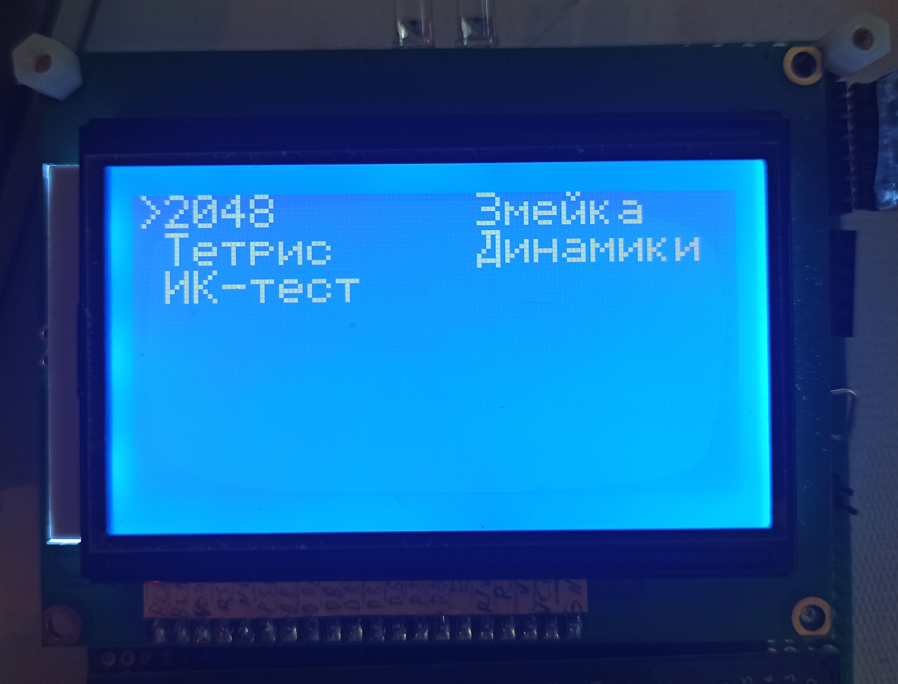
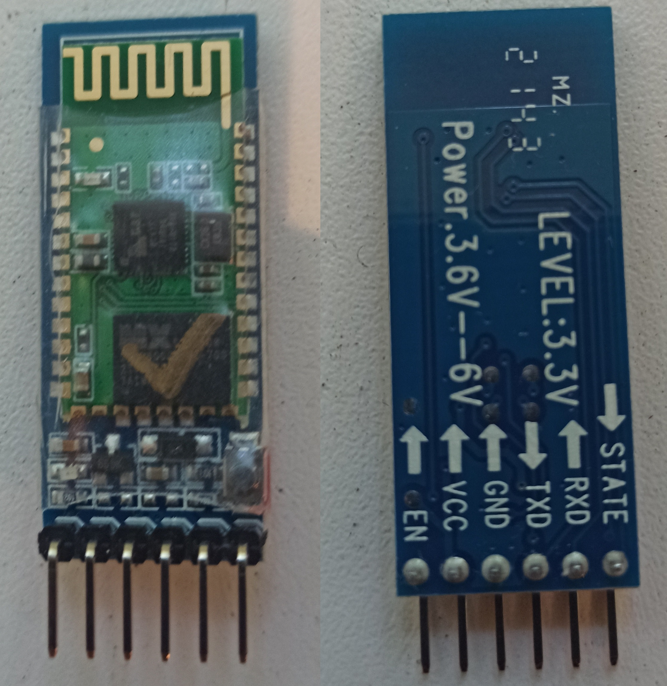

# Тестовый проект на STM32F051R8T6-discovery

  
    
  

## Проект включает в себя работы со следующими модулями:
* Создание меню на жидкокристаллическом дисплеем (ЖКИ, LCD) LCD12864B V2.0 и управление всей системой через него

  
  

* Прием команд с телефона по bluetooth модулю HC-05 (через приложение Serial Bluetooth Terminal)

  
  

* Прием ИК-команд от пульта
