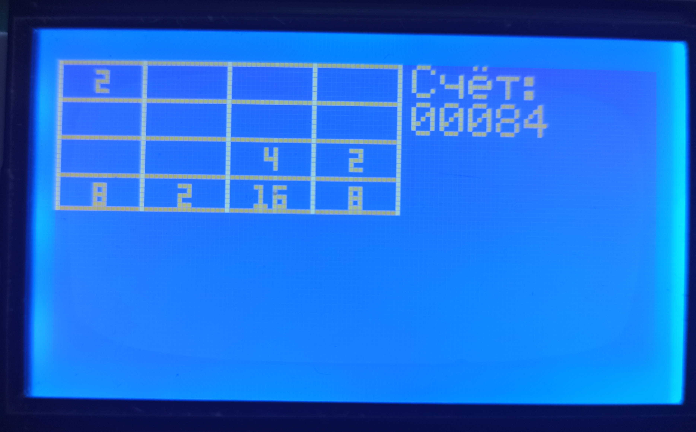
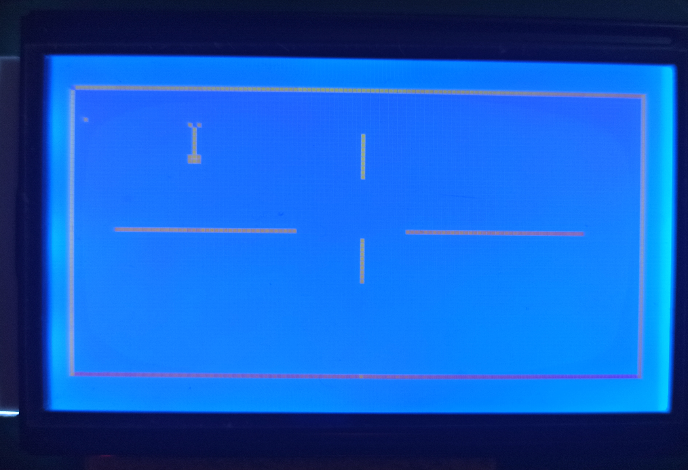
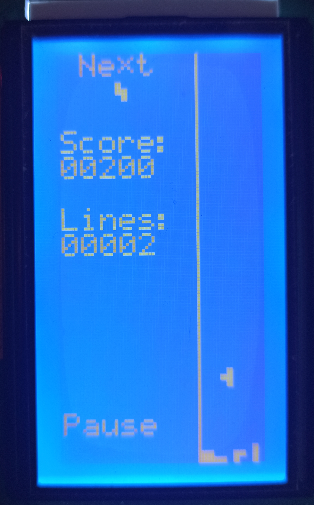
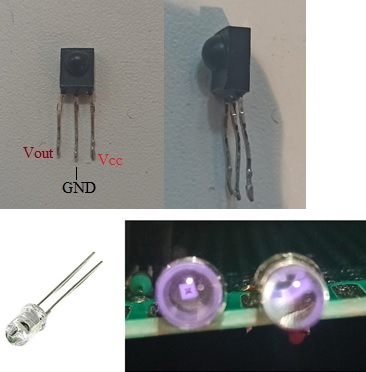
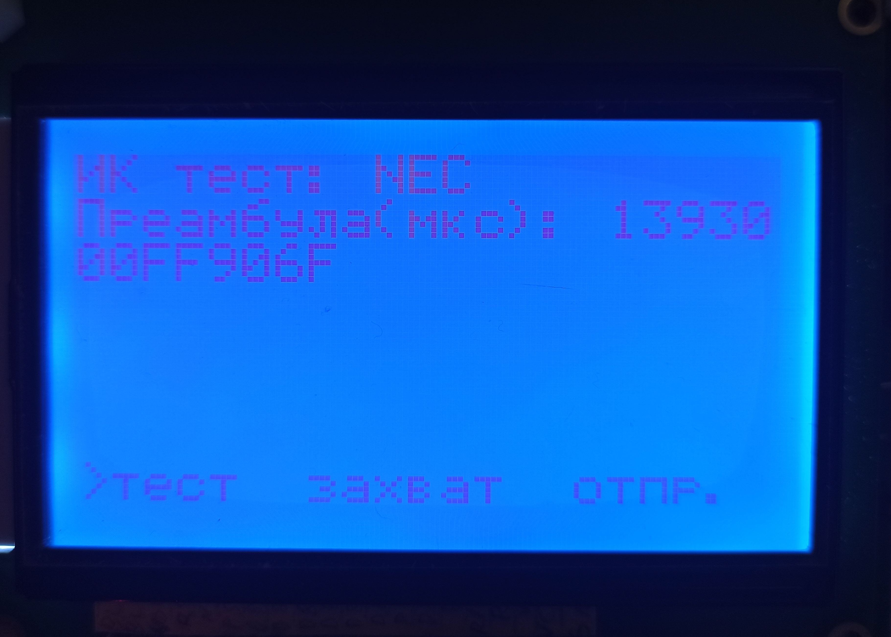

# Тестовый проект на STM32F051R8T6-discovery
Проект создавался в среде фирмы Keil -  uVision (V5.36.0.0) на микроконтроллере STM32F051R8T6. С помощью библиотеки CMSIS (V1.5.2), а также SPL (V1.5.1).

  
    
  

## В проекте реализованы следующие основные возможности
* Создание меню на жидкокристаллическом дисплеем (ЖКИ, LCD) LCD12864B V2.0 (на контроллере ST7920) и управление всей системой через него

  
  

* На этом дисплее реализованы три игры: 2048, змейка и тетрис

  
  
  
  

* Прием команд с телефона по bluetooth модулю HC-05 (через приложение Serial Bluetooth Terminal)

  
  

* Прием и анализ ИК-команд от пульта ДУ по протоколам NEC и Panasonic (используя таймеры в режиме захвата)
* Отправка команд с помощью ИК-светодиодов по этим же протоколам (используя ШИМ)

  
  
  

* Воспроизведение музыки через маленький или большой (с усилителем) электродинамики с помощью ШИМ

  
  

## Содержимое основных каталогов проекта
* CMSIS - папка, содержщей библиотеку CMSIS, с набором драйверов, примеров работы с переферией и набором всех основных регистров.
* Documents - папка со всей документацией к устройствам системы. В том числе, в ней содержатся: 
  1. Datasheet и прочяя документация на stm32F051.
  2. Datasheet на контроллер ST7920 дисплея LCD12864B, а также документ, описывающий работу с ним.
  3. Описание работы с ИК-протоколами, схемы подключения
  4. Описание работы с динамиками, схемы подключения.
  5. Электрическая принципиальная схема всей системы
* STM32F0xx_StdPeriph_Driver - набор файлов стандартной библиотеки для переферии (SPL).
* User - папка с исходным кодом (отдельно заголовочные и сишные файлы)
